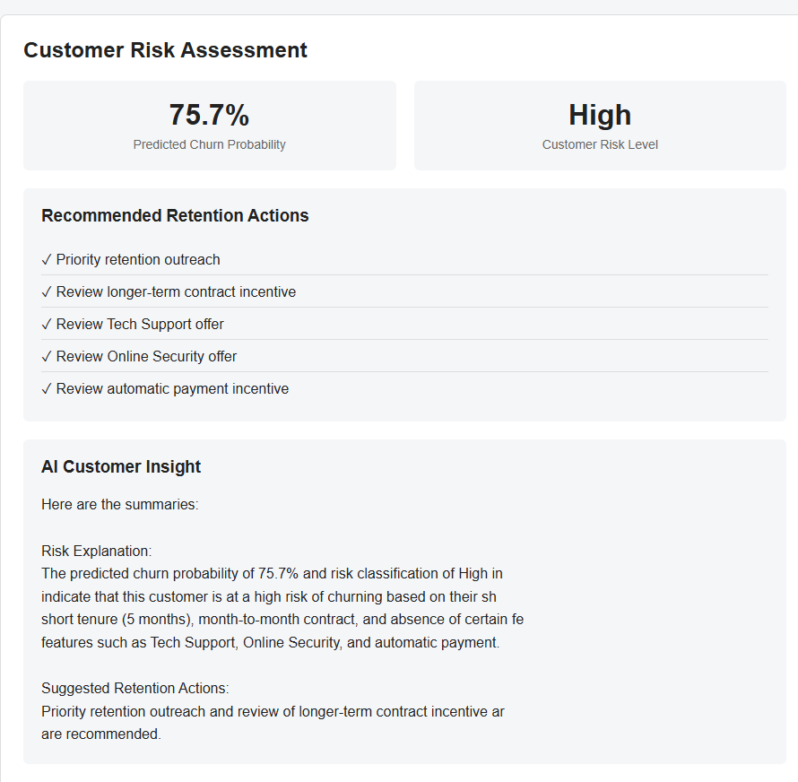
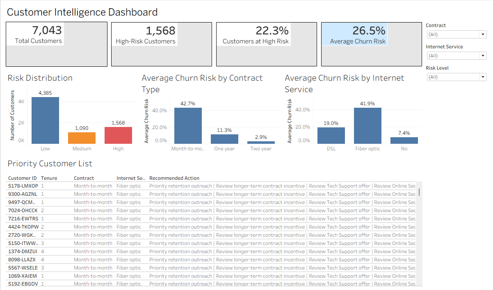

# Customer Intelligence Platform

An end-to-end customer churn analytics platform combining **statistical analysis, machine learning, neural networks, business intelligence, Flask deployment, and local Generative AI** to identify customers at risk of churn and support retention decisions.

The project analyzes **7,043 telecom customers**, identifies key churn patterns, compares multiple predictive models, generates customer-level churn probabilities, segments customers by risk, visualizes insights through Tableau, and provides AI-generated customer insights using a locally hosted Llama 3.2 model through Ollama.

---

## Project Overview

Customer churn is a major business challenge for subscription-based organizations. Predicting churn alone, however, is not enough. Businesses also need to understand:

- Which customers are most at risk?
- What characteristics are associated with churn?
- Which customers should retention teams prioritize?
- What actions could be considered?
- How can analytical results be made accessible to business users?

This project addresses the problem through an end-to-end analytics workflow.

---

## Solution Architecture

The platform contains two complementary workflows.

### Customer-Level Prediction

Customer Input  
↓  
Data Preprocessing  
↓  
Machine Learning Model  
↓  
Churn Probability  
↓  
Risk Classification  
↓  
Rule-Based Retention Recommendations  
↓  
Llama 3.2 via Ollama  
↓  
AI-Generated Customer Insight  
↓  
Flask Web Application

### Portfolio-Level Intelligence

Customer Dataset  
↓  
Exploratory Data Analysis  
↓  
Statistical Testing  
↓  
Machine Learning Predictions  
↓  
Customer Risk Segmentation  
↓  
Tableau Executive Dashboard

---

## Dataset

The project uses the IBM Telco Customer Churn dataset containing:

- **7,043 customers**
- Customer demographics
- Account tenure
- Internet and phone services
- Contract information
- Payment methods
- Monthly and total charges
- Customer churn status

Target variable:

`Churn`

- `Yes` — customer churned
- `No` — customer remained

Approximately **26.5%** of customers in the dataset churned.

---

## Exploratory Data Analysis

EDA was performed to understand customer behavior and identify patterns associated with churn.

Several strong patterns emerged.

### Contract Type

Observed churn rates:

- Month-to-month: **42.71%**
- One year: **11.27%**
- Two year: **2.83%**

A Chi-Square test indicated a statistically significant association between contract type and churn.

**Cramer's V ≈ 0.410**

---

### Customer Tenure

Median tenure:

- Non-churn customers: **38 months**
- Churn customers: **10 months**

Customers with shorter tenure showed substantially higher observed churn.

Tenure group churn rates:

- 0–12 months: **47.44%**
- 13–24 months: **28.71%**
- 25–48 months: **20.39%**
- 49–72 months: **9.51%**

**Cramer's V ≈ 0.349**

---

### Monthly Charges

Average monthly charges:

- Non-churn customers: **$64.43**
- Churn customers: **$79.65**

A statistical test found a significant difference in monthly charges between the two groups.

---

### Internet Service

Observed churn rates:

- DSL: **18.96%**
- Fiber optic: **41.89%**
- No internet service: **7.40%**

---

### Additional Churn Patterns

Higher observed churn was also found among customers with:

- Electronic check payment
- No Tech Support
- No Online Security
- No partner
- No dependents

These relationships are treated as **associations rather than causal relationships**.

---

## Data Preprocessing

The preprocessing workflow included:

- Data quality checks
- Handling blank `TotalCharges` values
- Numeric type conversion
- Train/test split
- Stratified sampling
- One-hot encoding of categorical variables
- Standardization of numerical variables
- Scikit-learn preprocessing pipelines

The train/test split preserved the original churn distribution.

---

## Machine Learning Models

Multiple classification models were evaluated.

| Model | Test Accuracy | ROC-AUC |
|---|---:|---:|
| Logistic Regression | 80.55% | 0.8420 |
| Decision Tree | 72.46% | 0.6510 |
| Tuned Decision Tree | 79.21% | 0.8295 |
| Random Forest | 78.14% | 0.8203 |
| Tuned Random Forest | 80.55% | **0.8441** |

The default Decision Tree and Random Forest showed substantial overfitting, reaching approximately **99.8% training accuracy**.

Hyperparameter tuning significantly improved model generalization.

The tuned Random Forest achieved the highest ROC-AUC, while Logistic Regression provided nearly identical predictive performance with greater interpretability.

---

## Neural Network Experiment

I also tested a feed-forward Artificial Neural Network to see whether a neural-network approach would improve churn prediction.

The ANN used the same train/test split as the traditional machine learning models. Categorical features were one-hot encoded and numerical features were standardized before training.

The network included:

- 32-neuron hidden layer with ReLU activation
- 20% dropout
- 16-neuron hidden layer with ReLU activation
- Sigmoid output layer
- Adam optimizer
- Binary cross-entropy loss
- Early stopping based on validation loss

### ANN Results

On the held-out test set:

| Model | Test Accuracy | ROC-AUC |
| --- | ---: | ---: |
| Logistic Regression | 80.55% | 0.8420 |
| Tuned Random Forest | **80.55%** | **0.8441** |
| ANN | 78.92% | 0.8402 |

The ANN produced a ROC-AUC of **0.8402**, which was competitive with the traditional models but did not outperform the tuned Random Forest.

For customers who actually churned, the ANN correctly identified 182 of 374 customers at the default 0.50 classification threshold.

Based on the test results, I kept the tuned Random Forest as the final prediction model. The ANN experiment was useful because it showed that adding model complexity did not improve performance on this structured tabular dataset.

---

## Customer Risk Segmentation

Instead of returning only a binary churn prediction, the platform calculates a **customer-level churn probability**.

Customers are then classified into actionable risk categories:

- Low Risk
- Medium Risk
- High Risk

This allows retention teams to prioritize customers rather than treating every churn prediction equally.

---

## Retention Recommendation Engine

The platform generates rule-based retention recommendations based on customer characteristics.

Examples include:

- Priority retention outreach
- Review longer-term contract incentives
- Review Tech Support offers
- Review Online Security offers
- Review automatic payment incentives

The recommendation engine is deliberately separated from the machine-learning prediction so that predictive output and business actions remain distinguishable.

---

## AI Customer Insights

The application integrates a locally hosted **Llama 3.2** model using **Ollama**.

The LLM receives:

- Customer characteristics
- ML churn probability
- Risk classification
- Validated analytical findings
- Rule-based retention recommendations

It then generates a concise natural-language explanation for business users.

Guardrails are included in the prompt to reduce unsupported claims and prevent the LLM from inventing churn timelines, customer value, causal relationships, or unvalidated recommendations.

The LLM does **not** predict churn. The machine-learning model performs prediction; the LLM acts only as an explanation layer.

---

## Flask Prediction Application

A Flask web application provides an interactive interface where users can enter customer characteristics and receive:

- Predicted churn probability
- Customer risk level
- Recommended retention actions
- AI-generated customer insight

### Application Example



---

## Tableau Executive Dashboard

A Tableau dashboard was developed to provide portfolio-level customer intelligence.

The dashboard enables business users to explore churn risk and customer patterns visually.

### Dashboard



The packaged Tableau workbook is available in the `tableau/` directory.

---

## Technologies Used

### Data Science & Machine Learning

- Python
- Pandas
- NumPy
- Scikit-learn
- SciPy
- TensorFlow / Keras
- Matplotlib

### Business Intelligence

- Tableau

### Generative AI

- Ollama
- Llama 3.2

### Application

- Flask
- HTML / CSS

### Development

- Jupyter Notebook
- Joblib
- Git / GitHub

---

## Project Structure

```text
Customer_Intelligence_Platform/
│
├── data/
│   ├── raw/
│   │   └── WA_Fn-UseC_-Telco-Customer-Churn.csv
│   └── processed/
│       ├── customer_intelligence_output.csv
│       └── model_comparison.csv
│
├── models/
│   ├── customer_churn_model.pkl
│   └── model_features.json
│
├── notebooks/
│   └── Customer_Intelligence_Platform.ipynb
│
├── screenshots/
│   ├── flask_churn_prediction.png
│   └── tableau_churn_dashboard.png
│
├── src/
│   ├── app.py
│   ├── predict.py
│   ├── ollama_explainer.py
│   └── templates/
│       └── index.html
│
├── tableau/
│   └── Customer_Intelligence_Platform.twbx
│
├── README.md
└── requirements.txt
